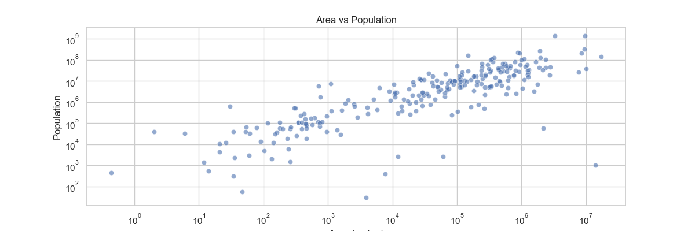

# REST Countries API ETL Project

This project implements a basic ETL (Extract, Transform, Load) pipeline that retrieves data from the REST Countries API, processes it, and loads it into a local SQL Sever database. This allows for easier analysis and querying of global country data.

## Project Overview

- **API Used**: [REST Countries API](https://restcountries.com/v3.1/all)
- **Objective**: Extract relevant country information, transform it for consistency, and store it in a local SQL Sever database.
- **Technologies**: Python, SQLite, pandas, requests

## Results


## Table of Contents

- [Requirements](#requirements)
- [Pipeline Architecture](#pipeline-architecture)
- [Step-by-Step Guide](#step-by-step-guide)
  - [1. Extract Data](#step-1-extract-data-from-rest-countries-api)
  - [2. Transform Data](#step-2-transform-data)
  - [3. Load Data](#step-3-load-data-into-sqlite-database)
  - [4. Query Data](#step-4-query-and-analyze-data)
- [Extensions](#potential-extensions)
- [Summary](#summary)

## Requirements

### Prerequisites

1. **Python 3.x**
2. **Required Libraries**:
    - `requests`: For HTTP requests to fetch API data.
    - `pandas`: For data manipulation and cleaning.
    - `sqlite3`: For database interactions.

Install dependencies:
```bash
pip install requests pandas
```

## Pipeline Architecture
- Extract: Retrieve data from the REST Countries API.
- Transform: Clean, reformat, and structure data as needed.
- Load: Store the processed data in a local SQLite database.

## Step-by-Step Guide

### Step 1: Extract Data from REST Countries API
- Use the endpoint https://restcountries.com/v3.1/all to fetch data.
- Implement the request with Python’s requests library.

### Step 2: Transform Data
- Select required fields and structure them in a pandas DataFrame.

### Step 3: Load Data into SQLite Database
- Use sqlite3 to create the database and load data.

### Step 4: Query and Analyze Data
- You can now query the database for analysis. Here’s an example query to retrieve countries with populations exceeding 100 million.

## Data Visualization

### 1. Descriptive Statistics
Objective: Get an overview of the data with key statistics.

### 2. Data Visualization
Objective: Visualize key attributes such as population and area.

### 3. Correlation Analysis
Objective: Analyze the correlation between population and area.

### 4. Group By Analysis
Objective: Analyze average population and area by region.

### 5. Density Analysis
Objective: Calculate population density and visualize it.

### 6. Top N Analysis
Objective: Find the top N countries by population or area.

### 7. Exporting Results
Objective: Export analysis results to CSV or Excel for reporting.

### Summary of Steps:
- Load data from SQL Server.
- Perform descriptive statistics.
- Visualize distributions and relationships using plots.
- Analyze correlations and group data by region.
- Calculate and visualize population density.
- Identify top N countries by specific metrics.
- Export analysis results for further reporting or presentation.

These analyses provide a comprehensive view of the data, revealing insights into country demographics, regional characteristics, and other trends that can be valuable for further studies or decision-making processes.

## Potential Extensions
- Regional Population Analysis: Calculate the average population by region.
- Population Density Calculation: Compute population density by dividing population by area.
- Report Generation: Export analysis results as a PDF or CSV report for sharing.
## Summary
This project demonstrates a simple yet effective ETL pipeline that uses REST Countries API data. By extracting, transforming, and loading data into a SQLite database, we facilitate further analysis of global country data with ease.
